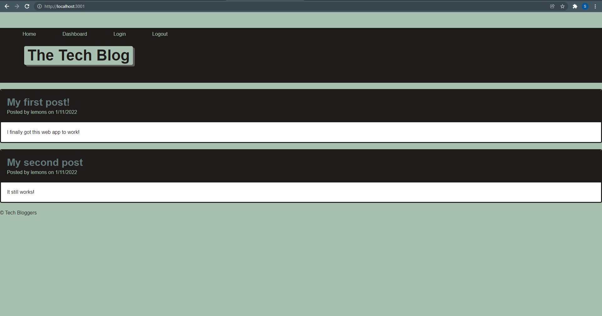

# Tech Blog

## About: 
The Tech Blog is a web app that uses express.js, handlebars, MySQL2 and Sequelize to run an website where uses can create a user and create, view, edit and delete posts about anything web tech related.  Users can also comment on others posts, as well as their own.

## Built With: 
* Handlebars 
* CSS 
* JavaScript 
* MySQL2 
* Sequelize 
* Dotenv 
* Express.js 
* Bcrypt 

## Website: 

https://slemons6.github.io/tech-blog

## Credit: 
Created by Shayne Lemons
